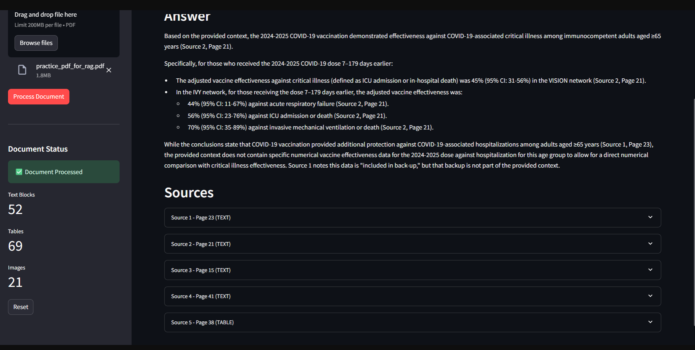
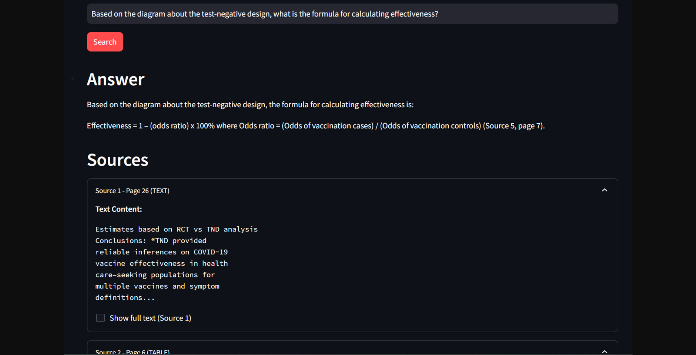

# Multi-Modal RAG Explorer 

A Multi-Modal Retrieval-Augmented Generation (RAG) system that ingests complex PDF documents containing text, tables, and images, and allows users to query them via a Streamlit interface.

## Why This Project?

Many RAG demos focus on simple text documents and fail when applied to real-world PDFs containing tables, diagrams, and complex layouts.  
This project explores how to build a **reliable, multi-modal RAG system** that can answer difficult, methodology-level questions from technical documents while remaining **grounded and verifiable**.

The system is designed to:
- Handle long, complex PDFs (e.g., research papers, reports)
- Retrieve information from text, tables, and diagrams
- Avoid hallucination by showing exact sources used in each answer


## Features

- **Multi-Modal Content Extraction**: Extracts text, tables (as markdown), and images from PDFs
- **LLM-Based Summarization**: Generates semantic summaries for tables and images using Gemini 2.5 Flash
- **Hybrid Retrieval**: Combines dense vector search and keyword search (BM25) with Reciprocal Rank Fusion (RRF)
- **Grounded Answers**: Provides answers with explicit source citations (page numbers, content type)
- **Streamlit UI**: User-friendly interface for document upload and querying

## Architecture

The system consists of modular components:

- **DocumentProcessor**: Handles PDF parsing (pdfplumber for text/tables, PyMuPDF for image extraction)
- **Summarizer**: Generates LLM summaries for tables and images
- **VectorStore**: Manages ChromaDB vector store with sentence transformers embeddings
- **Retriever**: Implements hybrid retrieval (dense + keyword + RRF)
- **AnswerGenerator**: Generates grounded answers using retrieved context

## Demonstrated Capabilities

The system has been tested on real-world technical PDFs (50+ pages) containing:
- Epidemiological study designs
- Statistical tables
- Methodology diagrams

Example queries successfully handled:
- Deriving formulas directly from study design diagrams (e.g., test-negative design effectiveness)
- Answering questions that require combining text explanations and table-based evidence
- Explaining technical concepts with explicit page-level citations




**Demonstration of grounded reasoning on a 52-page CDC epidemiological report. The system correctly retrieves and applies the Test-Negative Design formula for vaccine effectiveness from a diagram-based methodology section, with full source attribution**

### Evaluating document
https://www.cdc.gov/acip/downloads/slides-2025-09-18-19/04-Srinivasan-covid-508.pdf

## Installation

1. Clone the repository:
```bash
git clone <repository-url>
cd Multi_Modal_Rag_2.0
```

2. Install dependencies:
```bash
pip install -r requirements.txt
```

3. Install Tesseract OCR (optional, for scanned PDFs):
   - Windows: Download from [GitHub](https://github.com/UB-Mannheim/tesseract/wiki)
   - macOS: `brew install tesseract`
   - Linux: `sudo apt-get install tesseract-ocr`

4. Set up environment variables:
```bash
cp .env.example .env
# Edit .env and add your GEMINI_API_KEY
```

## Usage

1. Start the Streamlit app:
```bash
streamlit run app.py
```

2. Open your browser to the URL shown (typically `http://localhost:8501`)

3. In the sidebar:
   - Enter your Gemini API key
   - Upload a PDF document
   - Click "Process Document"

4. Ask questions about the document content (text, tables, or images)

## Technical Stack

- **PDF Processing**: pdfplumber (text/tables), PyMuPDF (images)
- **Image Handling**: Pillow, PyMuPDF
- **Embeddings**: SentenceTransformers (all-MiniLM-L6-v2)
- **Vector Store**: ChromaDB (local, in-memory)
- **Retrieval**: Dense search + BM25 keyword search + RRF fusion
- **LLM**: Google Gemini 1.5 Flash
- **UI**: Streamlit

## Design Principles

- **Correctness over complexity**: Focus on accurate retrieval and grounding
- **Modular components**: Each component is replaceable
- **Explicit grounding**: All answers include source citations
- **Session-scoped**: Single document per session, in-memory storage

## Non-Goals (v1)

- Persistent vector storage
- Multi-document querying
- Vision-based reasoning in final answer
- User-tunable retrieval parameters
- Authentication/user accounts

## Notes

- The system processes one document per session
- Tables are converted to markdown format
- Images are described via LLM (not directly used in final answer generation)
- All content is indexed via semantic summaries
- Original content is stored separately and retrieved for answer generation

## License


